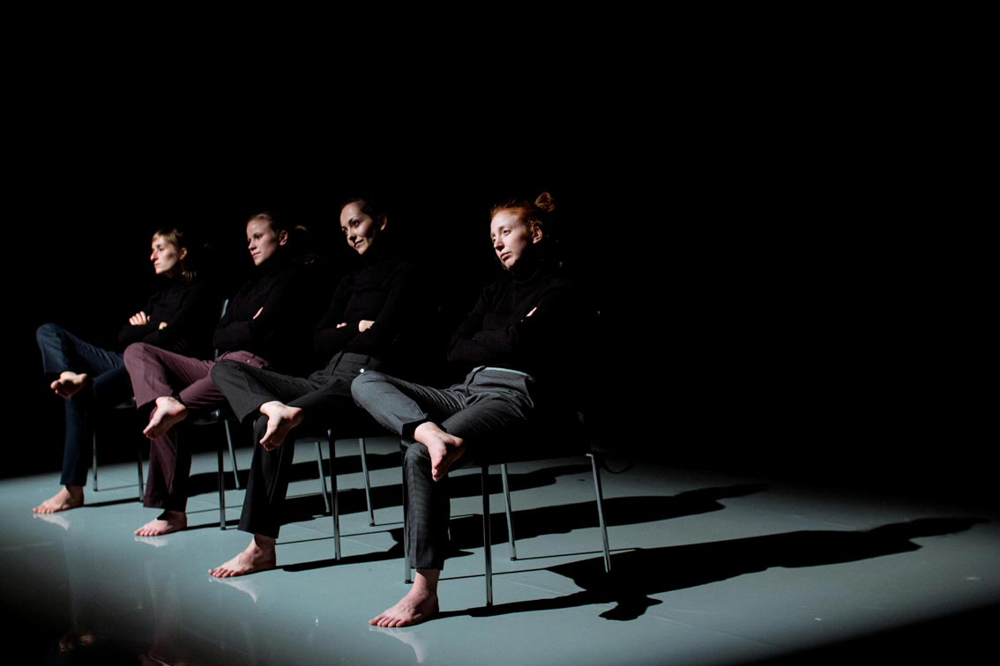

---

# CONFIGURATION
layout: 2016-turn
rootpath: "../../../"

# ABOUT THE SHOW - GENERIC
artist: "Turn 2016"
show: "SECOND NIGHT: Sat 23 Apr"
show_size: 4

# ABOUT THE SHOW - LAYOUT
header_image:

---
*A micro-festival of new northern dance, presented by* Word of Warning*,* Contact *+* Dance Manchester
        
#### Venue + Booking Details, for Turn 2016              
Dates: Friday 22 + Saturday 23 April 2016, 7.30pm       
<a href="http://contactmcr.com/visit/getting-here" target="_blank">Venue: Contact</a>, Oxford Road, Manchester, M15 6JA         
<a href="http://contactmcr.com/whats-on/47093-turn-2016/booking" target="_blank">Tickets: £9/5 per night</a> (two night pass £11/6)        
*<a href="http://www.contactmcr.com/ticketoffers" target="_blank">Group offer</a>: buy 10 (full or concession) tickets + get your 11th free.*        
Box Office Tel: 0161 274 0600                

#### Order of Appearance (subject to change)  
Ongoing from 6pm:                 
**Manoli Moriaty + Frances Kay | *Symbiosis***      
*Symbiosis*: where the performers become interconnected through motion sensors and tactile devices…         
[franceskayperformanceart.wordpress.com](http://franceskayperformanceart.wordpress.com/symbiosis)      

From 7.30pm:            
**Ina Colizza + Antonello Apicella | *Bruise***     
*"The continuous possibility of choice in everyone's life is nothing more than reality… a man and a woman showing to one another how feelings come up while bruises keep raising."*       
           
	  
**Adam John Roberts | *Awaiting Acknowledgement***        
*"At first, no one knew I was struggling. I wanted to keep it a secret… Fear took over and I started to cry. I thought, 'I'm not confident to put this on. I can't do it'… There is so much stigma around mental illness, and that's the reason you have to talk about it… But once you start to slide into that black hole you can’t ever imagine being well again."* Beverly Callard (Coronation St Liz McDonald)        
This expressive solo dance work is inspired by my personal experience of depression, stress and anxiety. It is a structured improvisation focusing on broken interpersonal relationships symbolised by the interaction between me, a rocking horse and a teddy bear who observe and switch roles within an empty children's playroom.         
[Website](http://adamrob1.wix.com/adamjohnroberts)        
         
          
**Sap Dance | *The Dusk Wood***     
A solitary dancer traces the trees of a wood as it descends from daytime, through dusk, into night.           
The work has emerged from an intensive process of recording the sound and motion of Grubbins Wood, an ancient wood in Arnside, Cumbria, managed by Cumbria Wildlife Trust.         
In each production, Sap Dance combines dance with at least one other art form, and seeks to distil and disclose aspects of the natural world. This has included short theatre pieces such as *Lune* (2005) and *Saturated Moment* (2006-7); full-length rural site-specific works in collaboration with Louise Ann Wilson Company, such as *Still Life* (2008, rev. 2009), and *Jack Scout* (2010); and the films *Jack Scout Redux* (2013) and *Still Life Redux* (2014).        
[Website](http://www.lancaster.ac.uk/fass/projects/jackscout)       
           
**Joseph Reay-Reid | *Moment to Moment***          
A couple, a spotlight, a spinning top of words and limbs.         
*Moment to Moment* is a dance theatre insight into human relations and how sometimes we find it difficult to connect with even the closest people in our lives.          
         
**Ekpei, McKie + Withycombe-Wharton | *Loquens In Latrina***     
*Did you ever think how much time you actually spent in the toilets when you were clubbing in the 80s?*            
Kema T. Ekpei presents Anne-Marie McKie + Bridget Withycombe-Wharton.        
[www.kema.org.uk](http://www.kema.org.uk)          
           
**Now | *Piece of Cake***    
*We'll be full of jollity and real good cheer,     
Happiness is what we want to make,        
Wipe your little tootsies on the front door mat     
And cut yourself a little piece of cake.*    

**Louise Gibbons | *Miss Baines***     
*Miss Baines* is a physical response to research into Lancashire's past, making you think twice about skipping that weekly hoover.     
*'Get it cleaned up, or you're out!'*        
 

**Brink Dance Company | *I carve or doodle and i Inspire***        
Exploring the fruitful and playful mind of Leonardo Da Vinci and his genius ideas.      
     

**Gracefool Collective | *This Really Is Too Much***    
Outlandish and highly entertaining, this piece of dance theatre delves into performance of identity. Witness the downright absurd reality of what it means to be a WO-man in modern society.         
[gracefoolcollective.com](http://gracefoolcollective.com)    
     
         
**Shelley Owen | *SpeedDating***    
*SpeedDating* explores the concept of organised social activity and interaction between people in a series of short conversations. Informed by social observation, this live composition work incorporates movement and sound, exposing the choreographer's choice in real-time.	    
[www.shelleyowendance.com](http://www.shelleyowendance.com)       
         
#### Access Information         
Turn 2016 takes place in a number of different spaces and formats around Contact's building — some seated, some standing, some limited capacity, some participatory. With intervals, each evening will last about 3 hours. Age advisory: 14+ (parental/guardian discretion). For specific age and access information please email <mailto:info@habarts.org> or call 0161 232 6086.            
       
#### Credits         
[Turn](/hab/turn) 2016 is co-produced by [hÅb](/hab), <a href="http://contactmcr.com" target="_blank">Contact</a> + <a href="http://www.digm.org" target="_blank">Dance Manchester</a>; supported using public funding by Arts Council England + funded by Manchester City Council. | Image: Jo Ashbridge, Turn Prize 2014 by Jerome Whittingham          
<a href="http://turnmcr.org" target="_blank">turnmcr.org</a> | <a href="http://twitter.com/hashtag/TurnMcr" target="_blank">#TurnMcr</a>          
         
#### Appearing on the [FIRST NIGHT: Fri 22 Apr](/current/2016-turn/fri)          
Jo Ashbridge | Tom Bowes Dance | Giorgio de Carolis | Bridget Fiske + Co. | Gayathri Ganapathy | Lizzie J Klotz | Holly Rush | Stream Project | Lauren Tucker
