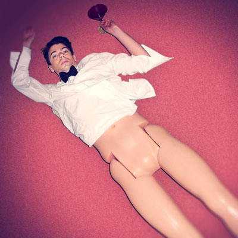
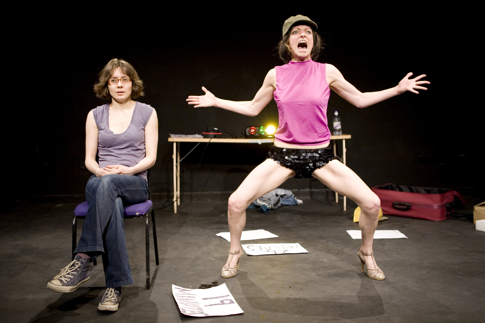

####In Brief
Tom entered the Pretty Polly *Best Legs of 2011* competition and reached the final&hellip; Tonight, Bristol’s loveliest legs are laid bare in all their glory&hellip;

Jen and Lucy went to see a show where the performers wrote them letters. They didn’t write back - so here’s their response&hellip;

##Legs 11
###Tom Marshman

####Who is he?
Hello, I'm Tom Marshman.

My shows are hand crafted, intimate, naughty, humorous, high brow, low brow, sensory, stomach churning, conversational, sentimental, physically demanding, staged and chance encounters. I have outrageous costumes and smart suits, eclectic music, sweet things to taste, a poetic voice and brutally honest language. My shows are low camp, moving, hit and run, fragile and memorable. And all made with an overwhelming desire to engage, seduce and entertain I’ve been making performance for over ten years, and created over 20 projects in a wide range of mediums including performance, photography, installation, publication and film. 

I have shown work in a variety of venues including Bristol Old Vic, Arnolfini (Bristol), Oval House, Chapter Arts Centre, Battersea Arts Centre, Basement Brighton, Colchester Arts Centre, Exeter Phoenix and within Festivals including National Review of Live Art, Inbetween Time and White Nights.

Collaborators include: Dan Canham, Sam Halmarack, Ben Pollock, Ziggy Jacobs,
Neil Bartlett MBE, Michael Pinchbeck, Bryony Kimmings, Joseph Mercier, Clara Giraud.

####What People Have Said About Him

>We fully support your project and if the quest for *Legs11* helps bring it to a more public view, we are delighted.
*David Hinchliffe, brands director, Pretty Polly.*

>One of the most exciting things about Marshman's work is his ability to pick a seemingly small subject and peel back the layers to expose something unexpectedly profound.
*The Big Issue*

>Brilliant.  Very funny, joyful, touching and inspiring.  
*Audience member, BAC scratch performance*

>Unapologetically sentimental, and loveable for it. 
*Tim Atack, Venue Magazine*

####More
Tom Marshman is mingling with fashionistas&hellip; but will his winning smile pull him through? 

Tom has an ambiguous relationship to his legs. He has suffered from varicose veins for a number of years, leading to discomfort, embarrassment and a series of operations. A new-found confidence encouraged Tom to delve into a world of celebrity, stockings, photoshoots, beauty pageants and gender misadventures, so imagine his surprise when he was shortlisted for the Pretty Polly *Best Legs of 2011* competition (and finished in 6th place).

In this intimate performance, Tom conveys a brave story of transformation, hospital visits and rejuvenation, running a half marathon and remembering past embarrassments. Heart-warming and funny, the show celebrates misfits through personal stories, songs and charmingly camp dances. 

####Website
[tommarshman.com](http://tommarshman.com/)   

##External
###GETINTHEBACKOFTHEVAN

####Who Are They?

<small>GETINTHEBACKOFTHEVAN</small> is Hester Chillingworth, Lucy McCormick and Jennifer Pick, a London-based performance company, formed in 2008.

Together they play with failure, attempt, endurance, utterance, trashiness, the pathetic, triumph, mess.  Based in London, they make theatre pieces and live art together… so far.  They are beginning to think about making some installations.

####Vanifesto
<small>GETINTHEBACKOFTHEVAN:</small>   
Make: broken genre performance  
Hold: a core belief in performance as dialogue      
Assert: that text does not always say what it says that it says it is saying      
Want: to transport you.  

####What People Have Said About Them
>External is michievous, hilarious and throught provoking
*Mark Ravenhill*

>External is a must-see
*Exeunt*

>Powerfully and unashamedly clever&hellip; I urge anyone with an interest in theatre to go and see this little gem.
*Whatsonstage*

>An ebulliently ramshackle celebration
*Time Out*

>Sharp, short, hilarious… External is undeniably accessible… a show you can read into endlessly and has you thinking about it well beyond the final applause.
*Spoonfed*

>Be warned, GETINTHEBACKOFTHEVAN is Marmite, and I hate Marmite.
*A Younger Theatre*

####More
Jen wants to talk to you. Lucy wants more.
They’ve got some stuff they found in a garage, a strict no-touch policy and conflicting ideas about how to keep you happy.

Maverick makers <small>GETINTHEBACKOFTHEVAN</small> went to see a show where the performers wrote them letters. They didn’t write back – instead this unravelling game of truth and lies is their response.

*External* hurls a conversation about authenticity and originality right out into the open and forces it to fight for its life, giggling, gnashing and doing its own head in.

Let’s get the party started.

####Website
[getinthebackofthevan.com](http://www.getinthebackofthevan.com/)

