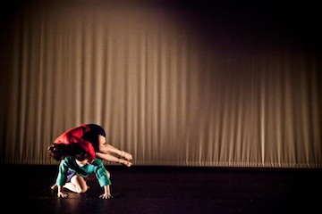

####In Brief
    

Bursting into life for its fourth outing, *Turn* pivots into a new home to showcase new and experimental work from the region’s dancemakers.  In a frenzy of loose limbs and lyrical gestures, unfeasible stretches and frantic rhythms, twelve shows and countless performers fill the building with every style imaginable. 

####Who Are They?
The list of artists participating is as follows.  Please remember that due to the nature of the event, things may change!    
     

THU 3 MAY     
	◦	Levantes Dance Theatre: *(R&D)*        
	◦	Jennifer Hale: Taciturn: *A Turn or Two*   
	◦	Maelstrom Dance: *BALLAST*   
	◦	Company Fierce Academy: *1 - The Sound Boy experience*   
	◦	Rachel Rimmer, Lisa Osborne-Kendall & Andrew Piekarczyk: *Chase/Conversation* (dance films)  
     

FRI 4 MAY:     
	◦	Emma Lansley & Eve Stainton: *Better Because I Wear Vintage*     
	◦	Katherine Hollinson: *Fantasy*    
	◦	Leentje Van de Cruys & Tine Feys: *Going to the Chapel*   
	◦	Joseph Lau: *Solo Study*   
	◦	Sarah Ojapah: *And Behold...*   
	◦	the dangerologists: *Work Songs*   
	◦	Hannah Buckley & Dwayne Antony Simms: *A Conversation (Part 1)*   
	◦	Ellen Turner: *Car-door moment*
	◦	Rachel Rimmer, Lisa Osborne-Kendall & Andrew Piekarczyk: *Chase/Conversation* (dance films)   
     

SAT 5 MAY:     
	◦	Kate Jackson Projects: *Solo*   
	◦	Le Petit Mort: *Cabaret Voltaire (solo)*   
	◦	dt.ellipsis: *It started with a riff*   
	◦	Joshua Hubbard: *Juan Loco*   
	◦	Mixed Movement    
	◦	Company Fierce Academy ◦	Company Fierce Academy: *1 - The Sound Boy experience*      
	◦	Rachel Rimmer, Lisa Osborne-Kendall & Andrew Piekarczyk: *Chase/Conversation* (dance films)   

Programme correct as of 13 April 2012   

####More
In its brief lifespan, *Turn* has seen a real surge in homegrown talent and vision –  mesmerising immersive landscapes, breathtaking physical extremes and extraordinary playful antics in the bar and street.  A true lucky-dip glimpse into just what the North West has to offer – check back here for the results of the open-call and to see just what this year’s turn-out will be.

####Website
[www.contactmcr.com/turnmcr](http://www.contactmcr.com/turnmcr)
[www.turnmcr.org](http://www.turnmcr.org)