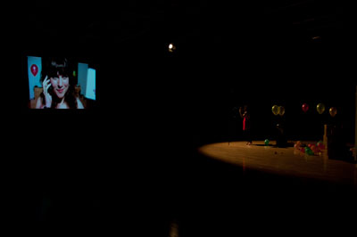

####In Brief
Olwen’s mother made her a golden dress because of her obsessive re-playing of Beauty and the Beast. She now has an excuse to wear it.  

Performed at casinos, festivals, toilets, wedding receptions and children's parties Canapé Art sees Levantes trickled in treacle and submerged in sugar in front of your very eyes.

Devastated by Diana? Mortified by Michael? A step by step guide to public bereavement – moral support, dutch courage and a little musical cheer. 

##Fridge Logic
###Olwen Davies

####Who is she?
Olwen Davies is a performance maker, actor and writer, making her own work and acting in external projects, most recently an independent feature film *43 Pounds* and performance company Zoo Indigo. Olwen trained at De Montfort University and co-founded the performance company Southpaw Junction. With an interest in the re-possession of cultural images on screen, comedy and the uses of recorded and live moments in performance, Olwen creates work that explores the audience’s relationship with the screen and with each other.

Olwen never expected to own a helium canister. 

[Watch video here](http://www.youtube.com/user/FridgeLogic/videos)

####More
Olwen, the performer, is attempting to make a movie.    
She is having trouble.     
She doesn’t have the resources she needs.     
She is not sexy enough, scary enough, entertaining enough.     
She needs you to believe in her and help her discover the emotive direction needed.    

Following classic narrative structures, referencing other famous movies and their characters, the piece takes a humorous and moving journey through bad re-enactment and the confessions of a lonely performer.

*Fridge Logic* explores and questions the audience’s relationship to the mediated performer within a media literate culture. For the 3 days leading up to the performance, [watch optional videos](http://www.youtube.com/user/FridgeLogic) that offer you a series of tasks to undertake in preparation for the show.

While creating the piece Olwen experimented a lot. She likes to play around when making work and have fun with it. While attempting something she thought would be wonderful she made a lot of mistakes. It turned out to be more interesting when she failed. 

She wanted to make a performance that would set the audience up as a community, for them to feel connected not only to the work but also to each other because of what they were experiencing. Harking back to the communal experience of ‘appointment television’ when we all sat down to watch Top of the Pops or more recently the X Factor simultaneously, she set about creating that moment of simultaneous tele-connection.

####Website
[www.olwendavies.com](http://www.olwendavies.com)    
[Youtube](http://www.youtube.com/user/FridgeLogic)    

##Canapé Art
###Levantes Dance Theatre

####Who are They?
Winners of the Oxford Samuel Beckett Trust Award in 2010, Levantes Dance Theatre is Bethanie Harrison and Eleni Edipidi.

Originally from Greece, Eleni trained at Laban and MMU and has toured internationally with the Belgian based company Victoria and has performed in the Opening Ceremonies of the Athens 2004 Olympic and Paralympics Games! Eleni was the recipient of The Marion North Mentoring Scheme 2009, with Lindsey Butcher as her mentor.

Bethanie trained in Dance and Visual Art at MMU and has co-directed and co-choreographed LDT since the beginning. Bethanie has collaborated with art practitioners Andre Gingras and Anna Macdonald and has lead workshops in schools in the Northwest with “Charged 2 dance”. Bethanie was the recipient of The Bonnie Bird New UK Choreography Award 2010.

Levantes Dance Theatre has a constant enthusiasm for fusing artistic disciplines and indulging in vibrant aesthetics. Current, bold and honest, the work visually explores contradictions: the mundane and divine, the absurd and the familiar in a kitsch cocoon of colourful activity.

####What People Have Said About Them
>The Northern Ballet foyer no longer bristles with the wary fascination of bystanders as Levantes Theatre mixed cupcakes, made paper-chains, flew paper aeroplanes, and scattered confetti into the early gloaming. *Aled Roberts, Head Receptionist, Northern Ballet.*

>Members of Levantes Dance Theatre trace ambiguous themes of compulsive disorders, pleasures and sins through an intensely visual display. Inventive props and wacky costumes feature high on the agenda…*Josephine Leask, Resolution* 

####More
*Canapé Art* is the performance of daily routine with a peculiar twist. A series of task are repeated, extended and submerged in sugar to playfully explore aspects of human behaviour.
*Canapé Art* is small pieces of play performed both amongst and in front of its audience, pockets of performance that hopefully trigger a smile.

####Website
[levantesdancetheatre.org](http://www.levantesdancetheatre.org)        

##Etiquette of Grief
###Ellie Harrison

####Who Is She?
Ellie Harrison is a performance maker and artist living and working in Leeds.
She creates a range of solo and collaborative devised performance work for studios, galleries, found and public spaces.

Previous performance work includes the touring solo show Dressing the Part which was shown across the UK at greenroom, Leeds Met Gallery & Studio Theatre, Oxford Playhouse Studio, Camden Peopleʼs Theatre and The Carriageworks.
 
Following Dressing the Part Ellie went on to make *Revolution!* with Ollie Smith, a performance specifically designed for Vodka Revolution bars and commissioned by HATCH and Nott Dance.  Ellie is on the Artistic Direction team of Pointed Arrow, making journey based public art projects including pushing a 1/2 tonne sailing boat 105 miles around the cities, villages and countryside of Yorkshire. 

####What People Have Said About Her
>Etiquette of Grief is a gem of a show. Smart, funny, touching, and performed with real conviction. Ellie Harrison is definitely one to watch. *Robert Pacitti, SPILL Festival of Performance*

>Etiquette of Grief is a remarkable piece of work. The atmosphere was fantastic. Iʼm delighted to be given the chance to recommend this show.  *Alex Kelly, Third Angel*

>I genuinely wanted to be brave enough to give you a standing ovation as I've never seen anything quite like it, either as meaningful or as funny  *Audience feedback*

>Etiquette of Grief struck to the core of my own grief having lost a close relative this year. It is refreshing to watch a performance about grief and death that is not awash with patronising sentiment. I cannot recommend this performance enough *Audience Feedback*

####More
*Etiquette of Grief* is a step by step guide for how to cope with bereavement. Thousands of people struggled to cope with the deaths of Princess Diana, Jade Goody, Michael Jackson and even occasionally their own loved ones. 

Ellie knows it can be difficult to express feelings of anger, sadness and loss. She would like to provide some moral support, Dutch courage and perhaps even a little musical accompaniment to help you at this testing time.

With inspiring messages from her digital alter-ego, interactive games and plenty of port, *Etiquette of Grief* unwraps our personal and national responses to grief and the grieving whilst celebrating the freedom of expression, even in our darkest moments.

*Etiquette of Grief* is the first piece in a sequence of seven works by Ellie Harrison entitled *The Grief Series*. Taking the seven stage Grief Model from popular psychology as a starting point, each instalment is a chance to collaborate with an artist working in a different discipline including performance, installation, photography and site-based work.

*Part 2, The Reservation*, a one to one performance for hotel rooms, is currently touring commissioning venues in Yorkshire and the North East. *Part 3, What is Left*, a participatory portraiture project is currently being developed with Manchester based photographer Roshana Rubin Mayhew.

**Excerpt from The Grief Series Blog**
*After the outpouring of grief at Princess Dianaʼs death, it was suggested that Britain had begun to embrace a culture of tears. But the tears I see are on screen, and are provoked by reality TV evictions and failures. These tears are a commodity. They keep the ratings up, help Mr Cowells bank balance and provide a moving ending to each show. They are Oscar nominated tears. They are not the complicated messy tears of real life. They are an extreme response to the everyday rather than an everyday response to extreme situations. People are just as afraid of the live expression of tears as they ever were. The grief series is an attempt to make the expression of grief less scary, for the bereaved and those surrounding or supporting the bereaved. I use my own experiences of bereavement, of course I do but it is not just about me. I donʼt want the work to be a form of public therapy for me and yet I am not resistant to the possibility of therapeutic by products, as long as the work remains open and relevant. I hope that by making space to think, feel and talk our way round grief, with other artists and participants/audiences, that there may be positive emotional and social outcomes. It is about reaching people.*   Ellie Harrison

####Credits
*Etiquette of Grief* was made and is being toured with support from Arts Council England, Seedbed Trust and Leeds University through the Incubator Fund.

####Website
[ellieharrison.org](http://www.ellieharrison.org/)

